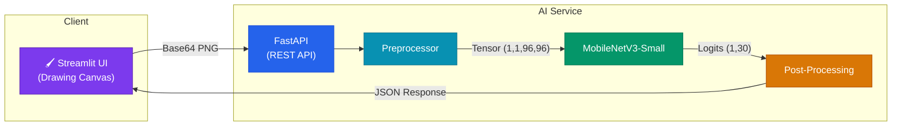
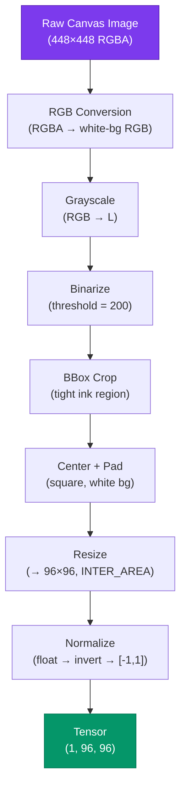
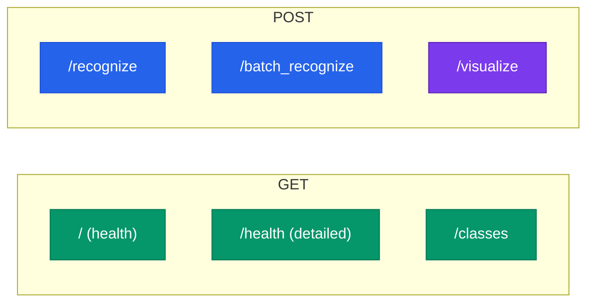

# Architecture

Technical overview of DoodleNet's data flow and system design.

## System Overview



## Preprocessing Pipeline

The preprocessing exactly mirrors the training pipeline to avoid train/inference skew.



## Model Architecture

| Property | Value |
| :--- | :--- |
| **Base Model** | MobileNetV3-Small (torchvision) |
| **Input** | `(B, 1, 96, 96)` — single-channel grayscale |
| **Output** | `(B, 30)` — logits over 30 doodle classes |
| **First Conv** | Modified: 3 → 1 input channels |
| **Classifier** | Standard MobileNetV3 head → 30 classes |
| **Parameters** | ~1.5M total |
| **Inference** | CPU: ~5ms, GPU: ~1ms |

### Modifications from Standard MobileNetV3

```python
# 1. Single-channel input (grayscale doodles, not RGB photos)
model.features[0][0] = Conv2d(1, 16, kernel_size=3, stride=2, padding=1)

# 2. 30-class output (Quick, Draw! categories, not ImageNet 1000)
model.classifier[-1] = Linear(1024, 30)
```

## API Endpoints



| Endpoint | Method | Purpose |
| :--- | :--- | :--- |
| `/` | GET | Quick health check |
| `/health` | GET | Model status + metadata |
| `/classes` | GET | List all 30 recognizable classes |
| `/recognize` | POST | Single doodle → confidence + top-5 |
| `/batch_recognize` | POST | Multiple doodles in one request |
| `/visualize` | POST | Returns the 96×96 preprocessed image the model sees |

## Doodle Classes (30)

```
Animals:   cat, dog, bird, fish, cow
Food:      apple, banana, pizza, cake, ice cream
Vehicles:  car, bicycle, airplane, bus, train
Scenery:   house, tree, flower, sun, cloud
Shapes:    star, moon, hand, face, clock
Objects:   book, chair, shoe, key, umbrella
```

## Project Layout

```
DoodleArena_AI/
├── ai_service/
│   ├── main.py            # FastAPI application + endpoints
│   ├── app.py             # Streamlit UI (Glassmorphism)
│   ├── model.py           # MobileNetV3Doodle architecture
│   ├── preprocessor.py    # Image → Tensor pipeline
│   ├── utils.py           # Softmax, top-k, class lookups
│   ├── model/best.pth     # Trained weights (gitignored)
│   ├── Dockerfile
│   └── requirements.txt
├── docker_compose.yml
├── ARCHITECTURE.md         # ← You are here
└── README.md
```
